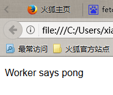
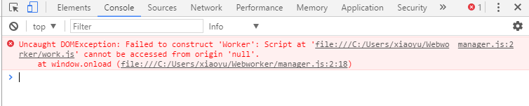

# Webworker
HTML5中新支持的多线程API实现手工制定异步任务无需浏览器‘等待’，提高用户体验
                <!DOCTYPE html>
                <html lang="en">
                <head>
                    <meta charset="UTF-8">
                    <title>Webworker</title>
                    
                </head>
                <body>
                    

                </body>
                </html>
在HTML页面中引入manager.js作为js执行的*主线程*
### manager.js代码
        window.onload = function () {
            var worker = new Worker('./work.js');
            worker.postMessage('ping');
            worker.onmessage = function (event) {
                var message = "Worker says " + event.data;
                document.getElementById('output').innerHTML = message;
            }
        }
在manager.js的主线程中新建了一个worker子线程，由该子线程了执行一些比较耗费时间的'任务',执行完毕后返回主线程。
注：一个子线程对应着一个.js文件，在此对应的是work.js,以下是work.js中的代码
                onmessage = function(event) {
                    if(event.data == 'ping'){
                        postMessage('pong');
                    }
                }
### 火狐浏览器运行结果，接受到返回的数据。
 
### 谷歌浏览器中控制台信息，貌似是Chrome默认关闭了Webwork功能，需要手动开启，才能正常使用。
 